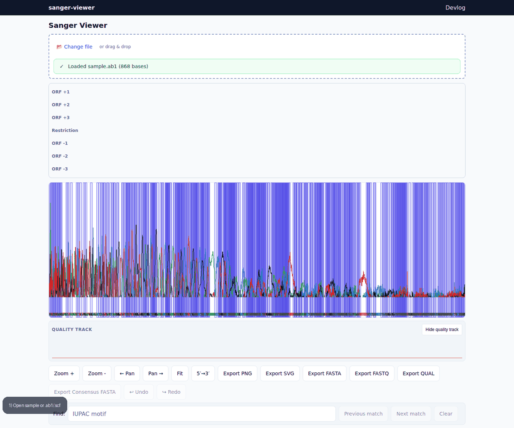

# sanger-viewer

Browser-native Sanger trace viewer for `.ab1` and `.scf` files — zero install, 100% client-side/private, and faster to open for quick inspection than desktop-first tools such as SnapGene Viewer, FinchTV, or Chromas.

**[Open sanger-viewer](https://animesh.kundus.in/sanger-viewer/)**



sanger-viewer is a private-by-default, browser-native Sanger workbench: open a trace instantly (including auto-loaded sample first impression), inspect and edit with confidence, share exact view state via client-side permalink hashes, and run reference alignment, variant review, contig assembly, and primer/in-silico PCR analysis — all in-browser, with trace data staying on your machine.

## Try it in 20 seconds

1. **[Open the live viewer](https://animesh.kundus.in/sanger-viewer/).**
2. A sample trace auto-loads, so you immediately see a rendered chromatogram with zero setup.
3. Drag and drop your own `.ab1` or `.scf` file, or open it with the file picker.

## Why browser-native?

All four tools can inspect trace files locally. sanger-viewer removes the desktop install and can encode the exact view state in a browser URL.

| | sanger-viewer | SnapGene Viewer | FinchTV | Chromas |
| --- | --- | --- | --- | --- |
| Install required | No | Yes | Yes | Yes |
| Cost | Free | Free viewer | Free | Free |
| Data privacy | Stays client-side in your browser; nothing uploaded | Local desktop app | Local desktop app | Local desktop app |
| `.ab1` + `.scf` support | Yes | Yes | Yes | Yes |
| Shareable permalink of the exact view | Yes | Not built in | Not built in | Not built in |
| Platform | Any modern browser | Desktop OS-specific | Desktop OS-specific | Desktop OS-specific |

## Why use it

- Open `.ab1` and `.scf` traces directly in the browser with drag-and-drop, file picker, or the built-in sample trace
- Inspect rendered chromatograms with quality shading, base labels, zoom/pan, reverse-complement viewing, tooltip hover, and a synced sequence panel
- Keep trace data private: parsing, rendering, and export stay client-side in the browser
- Use power features already shipping in the app today, including undo/redo edits, Q-trim, mixed-base calling, annotations, base inspection, multi-trace consensus, and PNG/SVG/FASTA export

## Supported formats

- `.ab1` ABIF traces
- `.scf` Standard Chromatogram Format traces

## Development

```bash
npm ci
npm run dev
```

## Validation

```bash
npm run lint
npm run typecheck
npm run test
npm run test:e2e
npm run perf:smoke
npm run build
```

## GitHub Pages

The app is configured with project base path `/sanger-viewer/` for production builds and deployed by `.github/workflows/deploy-pages.yml` on pushes to `main`.
A static devlog is published at `/sanger-viewer/blog/`.

## Fixtures

Fixture files are in `fixtures/` with provenance in `fixtures/PROVENANCE.md`.

## Metrics

We measure real usage with GitHub-native, server-side signals only — the app
ships **no analytics and no telemetry**, and no trace data ever leaves your
browser. The aha moment (first successful trace render), the AARRR funnel, the
pre-registered continue/iterate/pivot thresholds, and the privacy boundary are
documented in [`docs/measurement.md`](docs/measurement.md). A weekly workflow
appends repo-traffic snapshots to
[`docs/metrics/traffic-history.json`](docs/metrics/traffic-history.json).
