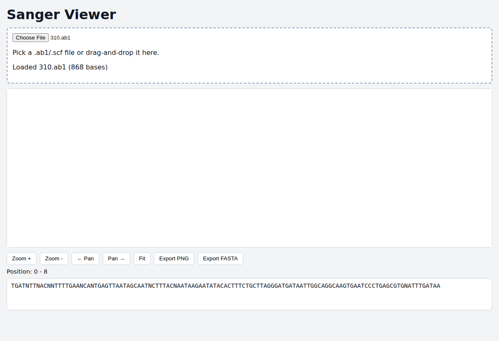

# sanger-viewer

Client-side Sanger sequencing trace viewer for `.ab1` and `.scf` files, built with TypeScript + Vite and deployable as a static GitHub Pages project site.



## Features

- File picker and drag-and-drop loading
- AB1 (ABIF) and SCF parsing of 4 channels, base calls, peak positions, and quality
- Canvas chromatogram rendering with quality shading, base labels, zoom/pan, tooltip hover
- Synced sequence panel and viewport position readout
- Export current view as PNG and sequence as FASTA

## Supported formats

- `.ab1` ABIF traces
- `.scf` Standard Chromatogram Format traces

## Development

```bash
npm ci
npm run dev
```

## Validation

```bash
npm run lint
npm run typecheck
npm run test
npm run test:e2e
npm run perf:smoke
npm run build
```

## GitHub Pages

The app is configured with project base path `/sanger-viewer/` for production builds and deployed by `.github/workflows/deploy-pages.yml` on pushes to `main`.
A static devlog is published at `/sanger-viewer/blog/`.

## Fixtures

Fixture files are in `fixtures/` with provenance in `fixtures/PROVENANCE.md`.
