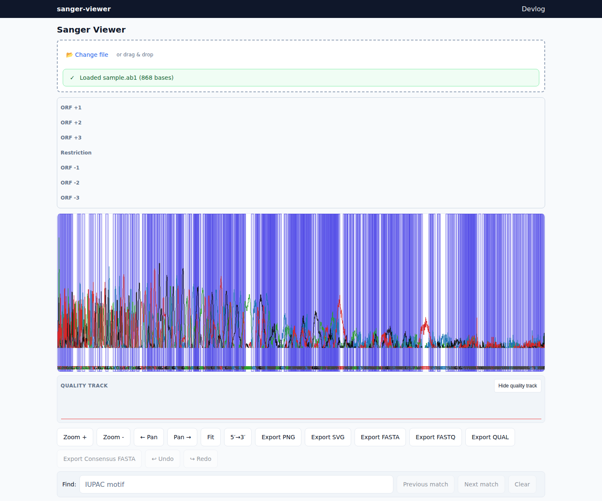

# sanger-viewer

Browser-native Sanger trace viewer for `.ab1` and `.scf` files — zero install, 100% client-side/private, and faster to open for quick inspection than desktop-first tools such as SnapGene Viewer, FinchTV, or Chromas.

**Live demo:** https://animeshkundu.github.io/sanger-viewer/



> The screenshot shows the current viewer after loading the built-in sample trace. The deployed app still opens to file/sample choice today; the auto-loaded first-impression pass is shipping separately.

## Why use it

- Open `.ab1` and `.scf` traces directly in the browser with drag-and-drop, file picker, or the built-in sample trace
- Inspect rendered chromatograms with quality shading, base labels, zoom/pan, tooltip hover, and a synced sequence panel
- Keep trace data private: parsing, rendering, and export stay client-side in the browser
- Use power features already shipping in the app today, including undo/redo edits, Q-trim, mixed-base calling, annotations, base inspection, multi-trace consensus, and PNG/SVG/FASTA export

## Supported formats

- `.ab1` ABIF traces
- `.scf` Standard Chromatogram Format traces

## Development

```bash
npm ci
npm run dev
```

## Validation

```bash
npm run lint
npm run typecheck
npm run test
npm run test:e2e
npm run perf:smoke
npm run build
```

## GitHub Pages

The app is configured with project base path `/sanger-viewer/` for production builds and deployed by `.github/workflows/deploy-pages.yml` on pushes to `main`.
A static devlog is published at `/sanger-viewer/blog/`.

## Fixtures

Fixture files are in `fixtures/` with provenance in `fixtures/PROVENANCE.md`.
